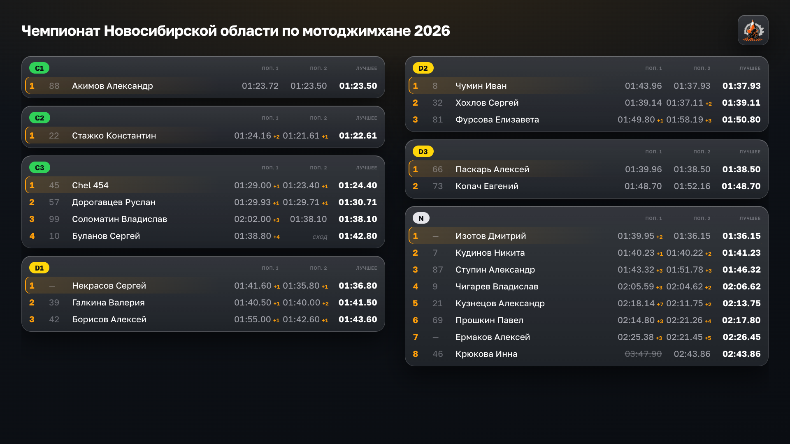
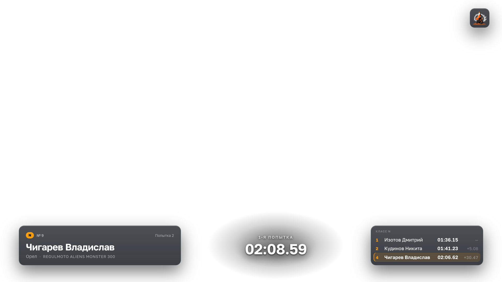
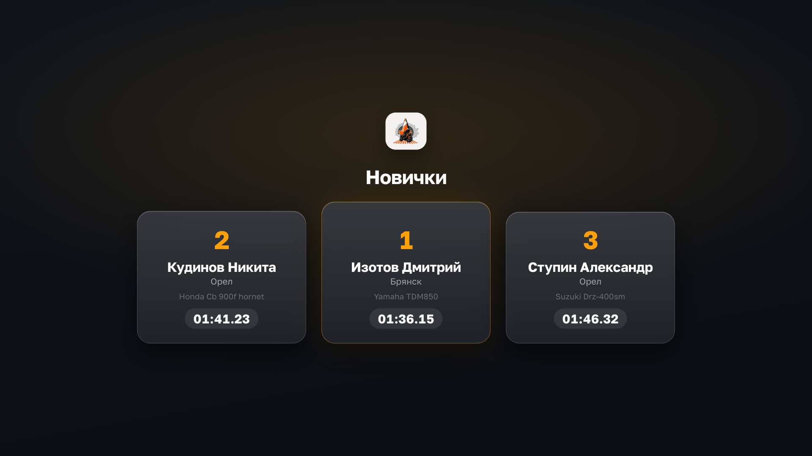

# MG — графический слой трансляции мотоджимханы

Оверлей для OBS Browser Source: таблица результатов, карточка заезда, хайлайты,
break-экран, награждение и тихая заставка. Результаты не вводятся руками — сервер опрашивает
страницу этапа на сайте федерации, где организаторы ведут протокол по ходу дня.

**Событие:** Чемпионат Новосибирской области по мотоджимхане 2026, 08.08.2026
**Вывод:** OBS → DistroAV (NDI) → основной микшер

## Запуск

```bash
npm install
npm run build     # собрать статику
npm start         # боевой этап 677, http://localhost:4300
```

Репетиция на архивном этапе с заполненными результатами:

```bash
STAGE_ID=670 npm start
```

| Адрес | Назначение |
|---|---|
| `http://localhost:4300/overlay` | Browser Source в OBS |
| `http://localhost:4300/control` | пульт оператора |

## День эфира

1. `npm start` — без переменных окружения это сразу боевой этап 677.
2. Открыть `http://localhost:4300/control`. Проверить, что счётчик «обновлено N с назад» тикает и **в строке состояния значится «этап 677» без предупреждения**. Жёлтая плашка «не боевой» означает, что сервер поднят на полигоне.
3. В OBS — Browser Source на `http://localhost:4300/overlay`, размер 1920×1080, «Transparent background» включён, **«Shutdown source when not visible» выключен** (иначе при переключении сцен рвётся связь с сервером).
4. Прощёлкать шесть сцен с пульта, сверить с превью в блоке «Что в кадре».
5. Проверить NDI на принимающем устройстве: DistroAV → NDI Output Settings → Program.

Если сервер упал — `npm start` возвращает и сцену, и данные из `state.json`.
Пересобирать ничего не нужно, статика собрана заранее.

## Пульт

Ввода результатов нет: их приносит опросчик. Оператор управляет только тем,
что сейчас в кадре.

**Главный жест:** набрать номер участника и нажать Enter — карточка уйдёт в эфир.
Набор номера сначала заполняет предпросмотр и лишь по Enter публикуется, поэтому
готовить следующего райдера можно прямо во время заезда предыдущего.

Поиск работает и по ФИО — у части участников номера не проставлены, и
безномерного райдера иначе не вызвать.

### Горячие клавиши

| Клавиша | Действие |
|---|---|
| `1`…`6` | Сцена: таблица, заезд, хайлайт, пауза, награждение, заставка |
| `/` | Курсор в поле номера |
| номер + `Enter` | Вывести райдера в эфир |
| `Esc` | Убрать фокус, скрыть хайлайт |

Цифры переключают сцены, только когда курсор не в поле ввода.

### Заставка

Клавиша `6` — тихий экран с логотипом. В отличие от паузы он ничего не
обещает зрителю, поэтому его можно держать в кадре сколько угодно:
пока настраиваешь камеру, ждёшь спортсмена или готовишься к следующему
блоку.

## Если что-то пошло не так

| Симптом | Что делать |
|---|---|
| Индикатор свежести пожелтел или покраснел | Опросчик не получает данные. Оверлей продолжает показывать последние хорошие — эфир не рвётся. Проверить сеть |
| В таблице пусто | Проверить в логе сервера строки `[poller]`. Данные не затираются при сбое, поэтому пусто означает, что удачного опроса не было ни разу |
| Результат конкретного участника не подтянулся | Развернуть «Аварийная правка результата» в пульте и вписать вручную. Это резервный путь, не рабочий |
| Сервер упал | `npm start` — состояние и данные поднимутся из `state.json` |

## Как это выглядит

Снимки всех сцен — в [docs/screenshots](docs/screenshots/).

| | |
|---|---|
|  |  |
| Общая таблица результатов | Заезд: карточка и топ-5 класса |
|  |  |
| Награждение | Заставка |

## Документация

- [Устройство проекта](ARCHITECTURE.md) — как работает, какие правила нельзя нарушать, как менять
- [Скриншоты](docs/screenshots/) — как выглядит каждая сцена
- [Дизайн](docs/superpowers/specs/2026-08-04-overlay-motojimkhana-design.md) — архитектура, модель данных, сцены, пульт
- [План реализации](docs/superpowers/plans/2026-08-04-overlay-motojimkhana.md) — задачи по шагам

## Разработка

```bash
npm test          # 58 тестов: парсер, состояние, опросчик, форматирование
npm run test:watch
```

Парсер таблицы покрыт тестами на сохранённом HTML двух реальных этапов
(`test/fixtures/`) — он единственное место, которое может внезапно сломаться
из-за смены вёрстки на чужом сайте, и проверяется без сети.
