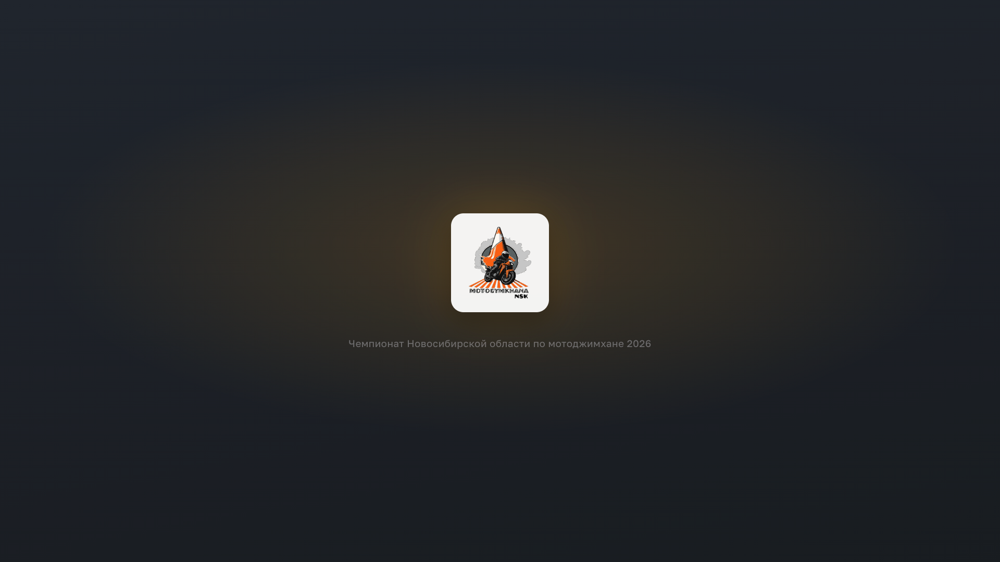

# MG — графический слой трансляции мотоджимханы

Оверлей для OBS Browser Source: таблица результатов, карточка заезда, хайлайты,
break-экран, награждение, тихая заставка и чистый кадр. Результаты не вводятся руками — сервер опрашивает
страницу этапа на сайте федерации, где организаторы ведут протокол по ходу дня.

**Событие:** Чемпионат Новосибирской области по мотоджимхане 2026, 08.08.2026
**Вывод:** OBS → DistroAV (NDI) → основной микшер

## Запуск

```bash
npm install
npm run build     # собрать статику
npm start         # боевой этап 677, http://localhost:4300
```

Репетиция на архивном этапе с заполненными результатами:

```bash
STAGE=670 npm start
STAGE='https://gymkhana-cup.ru/competitions/stage?id=670' npm start   # то же ссылкой
```

| Адрес | Назначение |
|---|---|
| `http://localhost:4300/overlay` | Browser Source в OBS |
| `http://localhost:4300/control` | пульт оператора |

Обе страницы открываются и с другого устройства сети — по адресу ноутбука
вместо `localhost`. Пароля у пульта нет: сеть площадки общая, и если пульт
живёт на том же ноутбуке, что и OBS, вход снаружи лучше закрыть —
`HOST=127.0.0.1 npm start`.

## Настройка

Всё, что меняется от этапа к этапу, лежит в **[`event.config.js`](event.config.js)**
в корне. Это единственный файл, который правят перед эфиром:

```js
eventTitle: 'Чемпионат Новосибирской области по мотоджимхане 2026',
logo: '/assets/logo.png',       // эмблема в кадре: файл в public/assets/ или ссылка
logoMark: '/assets/logo-mark.png',  // знак без надписи — для жучка в углу
stage: '677',            // номер этапа…
// stage: 'https://gymkhana-cup.ru/competitions/stage?id=677',   // …или ссылка целиком
stageUrlTemplate: 'https://gymkhana-cup.ru/competitions/stage?id={id}',
port: 4300,
pollInterval: 7000,      // как часто опрашивать сайт, мс
highlightTimeout: 6000,  // сколько держится хайлайт, мс
showRunTime: true,       // зона времени в заезде: таймер и время первой попытки
showClassTop: true,      // топ-3 группы награждения рядом с карточкой заезда
resultsByGroup: false,   // разрез итоговой таблицы при старте: классы или группы
awardGroups: [...],      // какие классы объединяются в награждение
strictGroups: true,      // один участник — одна группа; false разрешает двойной зачёт
```

**Группы награждения** задаются списком `awardGroups`: медали вручают не по
классам, а по их объединениям. На этапе 677 это Спортсмены (D1-B), Любители
(D2-D3), Новички (N-D4), Круизер и SB. Состав сверяют с блоком «Классы
награждения» в описании этапа на сайте — он меняется от этапа к этапу.

У Круизера и SB список классов пустой, и это не ошибка: их определяет
мотоцикл, а не индекс класса из протокола. Такие группы набирают руками
в пульте: в строке участника кликают по бейджам групп и отмечают нужные
галочками.

**По умолчанию участник состоит ровно в одной группе** (`strictGroups: true`):
отметка в меню переносит его, а не добавляет вторую. Снять все галочки —
законно, это «вне зачёта», и такой участник виден в пункте «Вне групп».

Если положение этапа допускает двойной зачёт, в конфиге ставят
`strictGroups: false`. Тогда галочка добавляет группу, не отнимая имеющуюся:
D2-шник на круизере награждается и в «Любителях», и в «Круизере» — класс
говорит о мастерстве, а Круизер и SB о мотоцикле. Чтобы человек ехал только
в «Круизере», группу по классу снимают отдельно.

Переключение режима посреди этапа ничего не ломает: проставленные пометки
не усекаются, а пульт покажет, у скольких участников осталось по несколько
групп, и подсветит их бейджи жёлтым.

Полная логика — в [docs/award-groups.md](docs/award-groups.md).

Если после правки в пульте появился пункт «Вне групп», значит чей-то класс
не попал ни в один список — участника либо потеряют при награждении, либо
надо дописать его класс в нужную группу. Вторая возможная причина — ручная
пометка на группу, которой уже нет в конфиге; тогда чинить нужно пометку
в пульте, а не список классов.

**Логотип задаётся двумя файлами** — под разные размеры в кадре. Оба кладут
в `public/assets/` и указывают путём от корня сайта (`/assets/…`); принимается
и полная ссылка на чужой хост. Папка отдаётся как есть, поэтому пересобирать
статику не нужно — достаточно перезапустить сервер. Нужен PNG с прозрачным
фоном: под эмблему подкладывается светлая плашка, и белый прямоугольник вокруг
был бы виден.

| Поле | Что это | Где в кадре |
|---|---|---|
| `logo` | эмблема целиком, с надписью | заставка — 138 px по высоте |
| `logoMark` | та же эмблема без надписи | пауза (92 px), награждение (60 px), жучок в углу заезда и таблицы (110 px) |

Надпись под эмблемой держится только на заставке. Ниже 138 px она превращается
в кашу, поэтому во все остальные слоты идёт знак: на тех же высотах он
узнаётся и выходит крупнее — вордмарк не отъедает шестую часть высоты.
Какой файл куда, решает сама сцена, руками это не переключают.

`logoMark` необязателен: без него везде встанет `logo`. Разово, без правки
файла: `LOGO=/assets/other.png npm start`, `LOGO_MARK=/assets/other-mark.png npm start`.

**Схема трассы** — поле `trackMap`, туда же в `public/assets/`:

```js
trackMap: '/assets/track-map.png',
```

Формат — картинка: PNG, JPG или SVG. **PDF не подойдёт**: страницу в OBS
рисует CEF, встроенного просмотрщика PDF там нет — скан экспортируют в PNG.

Размер не важен. Скан A4 при 300 dpi (3508×2480, несколько мегабайт) сервер
сам уменьшит до 1528×1080 и положит рядом копию `track-map.fit.webp`, а в кадр
отдаст её: в OBS страница перерисовывается на каждый вход в сцену, и лишние
мегабайты там дороги. Исходник останется нетронутым, копия в репозиторий
не идёт. Готовится она при `npm run build` и при старте сервера, поэтому скан,
положенный утром без пересборки, всё равно уедет в кадр лёгким. Проверить
руками: `npm run trackmap`.

Пусто или поле не задано — схемы на этапе нет: вкладка в пульте погашена,
клавиша `8` молчит. Разово погасить: `TRACK_MAP=0 npm start`; разово
подменить: `TRACK_MAP=/assets/other.png npm start`.

Сейчас в репозитории лежит заглушка — пустой лист A4 с надписью. Заменить
сканом настоящей схемы перед эфиром.

Этап задаётся **номером или полной ссылкой** — как удобнее. Ссылка нужна,
если адрес не собирается из номера: сайт переехал, у этапа отдельный URL.
Номер из ссылки система достаёт сама — им подписан пульт и назван файл состояния.

После правки — перезапуск сервера. **Пересобирать не нужно:** настройки живут
на сервере и приезжают в пульт и в кадр по WebSocket.

Разово, без правки файла: `STAGE=670 npm start`, `PORT=4310 npm start`.

## День эфира

0. **Таймер** — до всего остального, пока есть время. Подключить ноутбук к wifi прибора `StopWatcher1`, выполнить `npm run timer -- setup`, назвать сеть площадки и пароль, перезагрузить прибор питанием. Скрипт найдёт его в общей сети и напечатает готовую строку `timer: '…'` — вписать в `event.config.js`. Сеть обязана быть **2,4 ГГц**. Если что-то пошло не так, `npm run timer -- ap` вернёт прибор на его собственную точку, и эфир пройдёт без живого отсчёта: зона времени покажет время первой попытки, как раньше.
1. `npm start` — без переменных окружения это сразу боевой этап 677. В журнале должна появиться строка **`[timer] прибор отвечает`**: она значит, что прибор реально ответил, а не просто вписан в файл. Вместо неё `[timer] прибор не отвечает` — искать прибор, эфир при этом состоится и без него.
2. Открыть `http://localhost:4300/control`. Проверить, что счётчик «обновлено N с назад» тикает, рядом значится **«таймер на связи»**, и **в строке состояния «этап 677» без предупреждения**. Жёлтая плашка «не боевой» означает, что сервер поднят на полигоне.
3. В OBS — Browser Source на `http://localhost:4300/overlay`, размер 1920×1080, «Transparent background» включён, **«Shutdown source when not visible» выключен** (иначе при переключении сцен рвётся связь с сервером).
4. Прощёлкать семь сцен с пульта, сверить с превью в блоке «Что в кадре».
5. Выставить «Момент дня» на текущий отрезок программы — от него зависит текст на паузе.
6. Проверить NDI на принимающем устройстве: DistroAV → NDI Output Settings → Program.

Если сервер упал — `npm start` возвращает и сцену, и данные из `state.677.json`
(у каждого этапа свой файл, репетиция боевое состояние не затирает).
Пересобирать ничего не нужно, статика собрана заранее.

## Пульт

Ввода результатов нет: их приносит опросчик. Оператор управляет только тем,
что сейчас в кадре.

**Главный жест:** набрать номер участника и нажать Enter — карточка уйдёт в эфир.
Набор номера сначала заполняет предпросмотр и лишь по Enter публикуется, поэтому
готовить следующего райдера можно прямо во время заезда предыдущего.

Поиск работает и по ФИО — у части участников номера не проставлены, и
безномерного райдера иначе не вызвать. Если набранного номера нет в составе,
пульт скажет об этом и не даст вывести карточку: в эфир не уйдёт прежний райдер.

### Список участников

Правая колонка отдана списку целиком. Строки сгруппированы по классам — тем же
порядком, что в стартовом протоколе, — а над ними стоят счётчики и фильтры:

| Фильтр | Кого показывает | Когда нужен |
|---|---|---|
| все | весь состав | по умолчанию |
| без результата | ни одной попытки, неявка не отмечена | к концу дня — кого потеряли |
| вне групп | класс не попал ни в одну группу награждения | перед церемонией |
| неявки | отмеченные оператором | проверить отметки перед таблицей |
| имя группы | состав выбранной группы награждения | церемония |

Красная точка слева от класса — тот, кто сейчас в кадре: заезд или хайлайт.

Превью кадра вызывается чипом **«▸ кадр»** справа в строке состояния и само
всплывает на две секунды при каждой смене сцены. Постоянного места оно больше
не занимает — оно ушло списку.

### Кто не приехал

Часть заявленных на соревнования не приезжает. С сайта это не приходит никак:
у неприехавшего просто нет прокатов — ровно как у того, кто ещё не стартовал.
Различить их может только человек на площадке.

Поэтому неявку отмечает оператор — до начала заездов, кружком **✓** справа
в строке участника. Кружок краснеет, строка гаснет, и отмеченный **исчезает
из кадра целиком**: из итоговой таблицы в обоих разрезах, из топ-3 группы
рядом с карточкой заезда, с подиума и из всех счётчиков. Тем же кликом
отметка снимается.

Отметка переживает опрос сайта и перезапуск сервера. Если организатор привяжет
безномерному участнику профиль и его ключ сменится, отметка переедет вместе
с ним — как и пометка группы.

**Результат сильнее отметки.** Если у отмеченного появилось время, сход или
незачёт, он возвращается в кадр сам, а пульт подсветит строку жёлтым и покажет
фильтр «отмечены, но едут». Отметка — предположение, сделанное утром;
протокол — факт, и потерять в таблице человека, который проехал, хуже, чем
показать оператору противоречие. Разбираться с ним всё равно оператору: снять
отметку или оставить как есть.

По той же причине вывод участника в кадр — заездом или хайлайтом — снимает
отметку сразу: спортсмен, которого объявляют, участвует, даже если утром его
записали в неприехавшие.

**Того, кто сейчас в кадре, отметить нельзя** — кружок у него погашен.
Пока результата нет (а в первую попытку его и не бывает), отметка вынула бы
участника из состава сцен, и карточка в эфире погасла бы прямо во время
заезда. Промах мышью по соседней строке не должен стоить кадра. Снять отметку
при этом можно всегда.

### Момент дня

Панель «Момент дня» переключает, что написано на сцене «Пауза»: идут заезды,
перерыв, готовимся к награждению. Времени в текстах нет намеренно — программа
сдвигается всегда, а названная минута в кадре обязывает. Под кнопками показан текст, который
уйдёт в кадр, — выбор виден заранее. Это единственное место, где оператор
задаёт контекст, а не картинку.

### Таблица: по классам или по группам

Итоговая таблица показывается в двух разрезах, и это разный ответ на вопрос
«кто выиграл». **По классам** места считает сайт, и таблица сходится с
протоколом строка в строку. **По группам награждения** места считаем мы:
в «Любителях» D2 и D3 едут в одном зачёте, места идут насквозь, и первое
место там одно. Медали вручают по второй таблице, поэтому к концу дня
в кадре обычно она.

Переключает блок «Таблица» или клавиша `G`. В разрезе по группам у каждой
строки появляется бейдж класса — внутри группы иначе непонятно, кого обошёл
лидер. Пустые группы в кадр не идут: «Круизер» до первой пометки оператора
пуст, и пустая плашка читалась бы как потерянные данные.

Под кнопками — список секций, которые получатся в кадре, с числом человек
в каждой. **Жёлтая плашка «Вне групп» — сигнал:** у этих участников класс не
разобрался или снят весь зачёт, и до церемонии их надо развести руками
в списке справа. В разрезе по классам этого не видно вовсе.

С чего начинается день, задаёт `resultsByGroup` в `event.config.js`. Дальше
разрезом распоряжается пульт, и перезапуск сервера выбор оператора не
отменяет — иначе сервер, поднятый посреди награждения, молча вернул бы
таблицу к классам. То же и с тумблерами заезда. Вернуть значение из файла
можно, назвав тумблер прямо в командной строке: `RESULTS_BY_GROUP=0 npm start`.

### Горячие клавиши

| Клавиша | Действие |
|---|---|
| `1`…`8` | Сцена: таблица, заезд, хайлайт, пауза, награждение, заставка, чистый кадр, схема трассы |
| `/` | Курсор в поле номера |
| номер + `Enter` | Вывести райдера в эфир |
| `T` | Время в кадре — включить или погасить |
| `G` | Таблица: по классам ↔ по группам награждения |
| `S` | Сход: слово вместо времени до конца заезда |
| `Esc` | Закрыть меню групп; если оно не открыто — убрать фокус и скрыть хайлайт |

Цифры переключают сцены, только когда курсор не в поле ввода. Буквы ловятся
по клавише, а не по символу, поэтому работают и в русской раскладке.

**Сход** жмут, как только видно, что спортсмен не доедет, — не дожидаясь,
пока судья остановит таймер. Судья остановит его и на сходе, но это время
не результат, и в кадр ему нельзя: вместо цифр встанет слово «сход», а
пришедшее следом показание таймера будет проигнорировано. Пометка снимается
сама, когда в эфир уходит следующий заезд, — забыть её невозможно.

### Две заглушки, и они разные

Клавиша `6`, **Заставка** — тихий экран с логотипом. Он закрывает кадр
целиком, поэтому годится, когда картинку с камеры показывать нельзя вовсе.
В отличие от паузы он ничего не обещает зрителю и может висеть сколько угодно.

Клавиша `7`, **Чистый кадр** — прозрачная накладка: работает камера, а мы
держим только название соревнований слева сверху и логотип справа. Низ кадра
пуст целиком. Это для общего плана площадки, интервью, разминки — всего, что
показывать можно, а перекрывать графикой незачем.

Простое правило: камеру видно — `7`, камеру видеть не надо — `6`.

### Схема трассы

Клавиша `8`, **Схема** — сканированный лист во весь кадр под обычной шапкой
с названием соревнований. Показывают, пока комментатор разбирает трассу:
где связка, где разворот, где штрафуют.

Сцена умеет ровно одно — показать файл. Ни зума, ни прокрутки: трассу
разбирает голос, графике достаточно не мешать. Файл задаётся в
`event.config.js` — см. «Настройка» выше.

Вкладка погашена, если схема на этапе не задана. Если файл задан, но
не открылся — в кадре встанет строка «Схема трассы не загрузилась»:
битая иконка в эфире читалась бы как поломка графики вообще.

## Если что-то пошло не так

| Симптом | Что делать |
|---|---|
| Индикатор свежести пожелтел или покраснел | Опросчик не получает данные. Оверлей продолжает показывать последние хорошие — эфир не рвётся. Проверить сеть |
| В таблице пусто | Проверить в логе сервера строки `[poller]`. Данные не затираются при сбое, поэтому пусто означает, что удачного опроса не было ни разу |
| Обе страницы пустые | Не собрана статика. Сервер пишет об этом при старте: `npm run build` |
| Участник пропал из таблицы, хотя он на площадке | Стоит отметка «не приехал». Найти его в списке (фильтр «неявки») и снять кружком. Вывод в эфир снимает отметку сам |
| В таблице «незачёт», «сход» или зачёркнутое время | Так и должно быть. Зачёркнутая попытка — трасса пройдена, но результат не засчитан: в кадре время тоже зачёркнуто. `59:59.99` — заезд не завершён, в кадре слово «сход». В зачёт не идёт ни то, ни другое |
| Результат конкретного участника не подтянулся | Развернуть «Аварийная правка результата» в пульте и вписать вручную. Это резервный путь, не рабочий. Формат — как в протоколе: `01:23.72` или `01:23.7215`; неразборчивое значение пульт подсветит и не отправит. «Снять правку» возвращает данные сайта сразу |
| В пульте красное «ТАЙМЕР НЕ ОТВЕЧАЕТ» | Прибор молчит дольше трёх секунд: выключился, уехал из сети, перезагрузился роутер. Эфир не рвётся — зона времени показывает время первой попытки. Проверить питание прибора и адрес в `event.config.js` |
| Сервер упал | `npm start` — состояние и данные поднимутся из `state.677.json`. Хайлайт, висевший в момент падения, снимется сам |
| В журнале `[state] файл состояния повреждён` | Запись оборвалась на полуслове: сервер начал день с чистого состояния, правки и пометки групп придётся расставить заново. Прежний файл лежит рядом как `state.677.json.broken` — из него можно вычитать, что было |
| `EADDRINUSE :4300` | Сервер уже запущен в другом окне терминала. Второй экземпляр не нужен: пульт и оверлей подключаются к одному |

## Как это выглядит

Снимки всех сцен — в [docs/screenshots](docs/screenshots/).

| | |
|---|---|
|  |  |
| Общая таблица результатов | Заезд: карточка, зона времени и топ-3 группы |
|  |  |
| Награждение | Заставка |
|  | |
| Чистый кадр: накладка поверх живой картинки | |

## Документация

- [Устройство проекта](ARCHITECTURE.md) — как работает, какие правила нельзя нарушать, как менять
- [Скриншоты](docs/screenshots/) — как выглядит каждая сцена
- [Дизайн](docs/superpowers/specs/2026-08-04-overlay-motojimkhana-design.md) — архитектура, модель данных, сцены, пульт
- [План реализации](docs/superpowers/plans/2026-08-04-overlay-motojimkhana.md) — задачи по шагам

## Разработка

```bash
npm test          # 449 тестов: парсер, состояние, опросчик, арифметика и порядок, группы, явка, моменты дня
npm run test:watch
```

Парсер таблицы покрыт тестами на сохранённом HTML двух реальных этапов
(`test/fixtures/`) — он единственное место, которое может внезапно сломаться
из-за смены вёрстки на чужом сайте, и проверяется без сети.

### Если сайт поменял таблицу

```bash
npm run fixture          # скачать свежую страницу боевого этапа
npm run fixture -- 670   # или другого — номером либо ссылкой
npm test                 # упавшие тесты покажут, что именно разъехалось
```

Правится `LAYOUT` в начале `server/parser.js` — селектор таблицы, порядок
колонок, цвета классов. Ниже по файлу лезть обычно не приходится: тесты
проверяют, что смены разметки чинятся именно там. Подробнее — в
[ARCHITECTURE](ARCHITECTURE.md#парсер-сломался-сайт-поменял-вёрстку).
