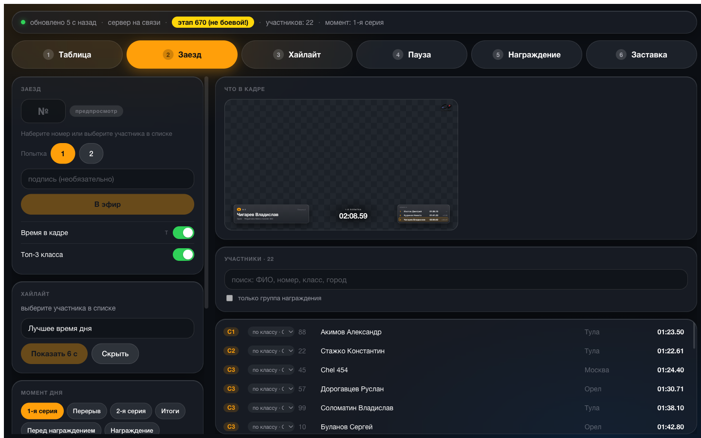

# MG Overlay — графика трансляции мотоджимханы

Оверлей для OBS Browser Source и пульт оператора к нему: таблица
результатов, карточка заезда, хайлайт, пауза, награждение, схема трассы.

## Общая концепция

**Система показывает протокол, а не ведёт его.** Результаты приходят
со страницы этапа на gymkhana-cup.ru, где секретарь соревнований ведёт
протокол по ходу дня. Сервер опрашивает её раз в несколько секунд и
рассылает изменения в кадр — сайт и есть единственный источник правды.

Отсюда задумка: развести обязанности на две работы, идущие параллельно.

| Кто | Что делает | Где работает |
|---|---|---|
| **Секретарь** | вносит время заездов и штрафы по факту финиша | сайт с протоколом этапа |
| **Оператор графики** | выводит в кадр спортсмена, таблицу, паузу, награждение | пульт `/control` |

Оператор графики вызывает райдера по номеру и переключает сцены — места,
лучшее время и рейтинги пересчитываются сами, заходить на сайт ему
незачем. Совмещать обе работы можно, и на небольшом старте один человек
справится, но в эфире они спорят за время: пока ищешь строку в протоколе,
в кадре некому вывести следующего участника.

Поля для ввода времени в пульте есть — блок «Аварийная правка результата»:
резерв на случай, когда результат не подтянулся с сайта. **Вести им протокол
не стоит** — два источника правды неизбежно разойдутся, и в эфире окажется
одно, а в итоговом протоколе другое.

**Что требуется от организаторов:** результат должен попадать на сайт
**сразу после заезда**, а не пачками в конце серии. Иначе весь день
в кадре будет стоять таблица получасовой давности — графика покажет ровно
то, что успели внести. Других требований у системы нет.

**Тонкий слой, а не ещё одна система.** Своей базы и своего протокола
графика не заводит — она садится на то, что на площадке уже есть:

- **результаты** — прямо со страницы этапа, без выгрузок, импорта и сверок;
- **живое время заезда** — с секундомера на трассе по общей сети, без второй машины и моста. Прибора может и не быть: тогда в зоне времени стоит результат первой попытки;
- **кадр** — обычный Browser Source в OBS, без плагинов и своего рендерера.

Из оборудования нужен только ноутбук, на котором и так крутится OBS,
общий wifi и интернет для опроса сайта.

Репозиторий обезличен: название соревнований, логотип, афиша и схема
трассы — заглушки. Всё своё подставляется в одном файле и двух папках,
без правки кода.

<table>
<tr>
<td></td>
<td></td>
</tr>
<tr>
<td></td>
<td></td>
</tr>
</table>

## Запуск

```bash
npm install
npm run build     # собрать статику — один раз и после правки кода в app/
npm start         # http://localhost:4300
```

| Адрес | Назначение |
|---|---|
| `http://localhost:4300/overlay` | Browser Source в OBS, 1920×1080 |
| `http://localhost:4300/control` | пульт оператора |

Обе страницы открываются и с другого устройства сети — по адресу ноутбука
вместо `localhost`. Пароля у пульта нет: если он живёт на том же ноутбуке,
что и OBS, вход снаружи лучше закрыть — `HOST=127.0.0.1 npm start`.

В OBS: Browser Source 1920×1080, «Transparent background» включён,
**«Shutdown source when not visible» выключен** — иначе при переключении
сцен рвётся связь с сервером.

## Настройка под своё соревнование

Всё, что меняется от старта к старту, лежит в **[`event.config.js`](event.config.js)**
в корне. Это единственный файл, который правят перед эфиром. После правки —
перезапуск сервера; **пересобирать не нужно**: настройки живут на сервере
и приезжают в пульт и в кадр по WebSocket.

```js
eventTitle: 'Кубок города по мотоджимхане 2026',  // шапка кадра
stage: '677',                                     // этап на сайте gymkhana-cup.ru
timer: '192.168.1.97',                            // прибор на трассе, можно пусто
trackMap: '/assets/track-map.svg',                // схема трассы, можно пусто
logo: '/assets/logo.png',                         // эмблема с надписью
logoMark: '/assets/logo-mark.png',                // знак без надписи
awardGroups: [ … ],                               // группы награждения
```

### Как подключить этап

`stage` — страница протокола, откуда берутся результаты. Задаётся **номером
или полной ссылкой**, как удобнее:

```js
stage: '677',
stage: 'https://gymkhana-cup.ru/competitions/stage?id=677',
```

Из номера адрес собирается по шаблону `stageUrlTemplate` — его правят, если
сайт переехал или протокол ведут на другом ресурсе. Ссылка нужна там, где
адрес из номера не собирается. Номер система достаёт из ссылки сама: им
подписан пульт и назван файл состояния.

Разово, без правки файла — репетиция на архивном этапе с заполненными
результатами:

```bash
STAGE=670 npm start
```

Пока в файле вписан боевой этап, пульт подсветит жёлтым всё, что ему
не равно, — забыть, что сервер поднят на полигоне, невозможно. В шаблоне
поле пустое, и подсвечивать не с чем: сравнение появится вместе с боевым
этапом.

Опрос идёт раз в `pollInterval` мс — в шаблоне 5000. Сбой опроса ничего
не затирает: в кадре остаются последние хорошие данные, а индикатор свежести
в пульте желтеет.

### Как подключить таймер

Секундомер на трассе — прибор **MG StopWatcher**. В поле `timer` пишут его
адрес в сети площадки:

```js
timer: '192.168.1.97',
```

Прибор из коробки раздаёт свою точку `StopWatcher1` и живёт на `192.168.4.1`.
Чтобы он зашёл в общую сеть площадки, его надо перевести в клиентский режим:
в веб-интерфейсе добавить сеть площадки и переключить режим на `client`.
То же делает скрипт — он заодно найдёт прибор в новой сети и напечатает
готовую строку для конфига:

```bash
# подключить ноутбук к wifi StopWatcher1, затем:
npm run timer            # найти прибор и показать его настройки
npm run timer -- setup   # спросит имя сети и пароль, запишет, дождётся перезагрузки
npm run timer -- ap      # вернуть прибор на его собственную точку
```

Сеть площадки обязана быть **2,4 ГГц** (5 ГГц прибор не видит физически),
WPA2 или открытая, без портала со входом, с выключенной изоляцией клиентов.
Адрес за прибором лучше закрепить в роутере по MAC — иначе после
перезагрузки роутера строка в конфиге станет враньём.

Проверка после старта: в журнале сервера — `[timer] прибор отвечает`,
в строке состояния пульта — «таймер на связи». Молчание дольше трёх секунд
зажигает красное «ТАЙМЕР НЕ ОТВЕЧАЕТ».

**Таймер необязателен.** Пустое поле `timer` — рабочее состояние, а не
поломка: зона времени в кадре просто показывает время первой попытки тем,
кто едет вторую. Разово погасить прибор: `TIMER=0 npm start`.

### Логотип, схема трассы, афиша

Файлы кладут в `public/assets/` и указывают путём от корня сайта
(`/assets/…`); принимается и полная ссылка на чужой хост. Папка отдаётся
как есть — **пересобирать статику не нужно**, достаточно перезапустить
сервер.

| Файл | Что это | Где в кадре |
|---|---|---|
| `logo.png` | эмблема с надписью | заставка (138 px) |
| `logo-mark.png` | тот же знак без надписи | пауза, награждение, жучок в углу |
| `track-map.*` | скан схемы трассы | сцена «Схема», клавиша `8` |
| `poster.jpg` | афиша 640×960 | баннеры-заставки в OBS |

Логотипу нужен PNG с прозрачным фоном: под эмблему подкладывается светлая
плашка, и белый прямоугольник вокруг был бы виден. `logoMark` необязателен —
без него везде встанет `logo`.

Схема — картинка (PNG, JPG, SVG), **не PDF**: страницу в OBS рисует CEF,
просмотрщика PDF там нет. Размер не важен: скан A4 на 300 dpi сервер сам
уменьшит до 1528×1080 и в кадр отдаст лёгкую копию. Пустое поле `trackMap`
гасит сцену и клавишу `8`.

Афиша идёт не в оверлей, а в полноэкранные баннеры-заставки, которые
снимают из шаблона `public/assets/banners/banner.html` — см.
[инструкцию рядом](public/assets/banners/README.md).

### Группы награждения

Медали вручают не по классам, а по их объединениям — они задаются списком
`awardGroups` и сверяются с блоком «Классы награждения» на странице этапа:

```js
awardGroups: [
  { name: 'Спортсмены', classes: ['A', 'B', 'C1', 'C2', 'C3', 'D1'] },
  { name: 'Любители',   classes: ['D2', 'D3'] },
  { name: 'Новички',    classes: ['D4', 'N'] },
  { name: 'Круизер',    classes: [] },   // набирается руками в пульте
  { name: 'SB',         classes: [] },
],
strictGroups: true,   // участник ровно в одной группе, если false, то можно быть в нескольких группах
```

Пустой `classes` — не ошибка: Круизер и SB определяет мотоцикл, а не индекс
класса из протокола, и такие группы набирают галочками в пульте.
`strictGroups: false` разрешает двойной зачёт, если его допускает положение
соревнований. Полная логика — в [docs/award-groups.md](docs/award-groups.md).

Если в пульте появился пункт **«Вне групп»** — чей-то класс не попал ни
в один список, и на награждении его потеряют.

### Переменные окружения

Разовое изменение без правки файла — на репетиции и когда лезть в конфиг
перед эфиром боязно:

| Переменная | Что делает |
|---|---|
| `STAGE=670` | другой этап: номером или ссылкой |
| `PORT=4310` | другой порт |
| `HOST=127.0.0.1` | закрыть вход снаружи |
| `TIMER=192.168.1.97` · `TIMER=0` | адрес прибора · погасить таймер |
| `TRACK_MAP=/assets/x.png` · `TRACK_MAP=0` | другая схема · погасить сцену |
| `LOGO=` · `LOGO_MARK=` | другие логотипы |
| `RESULTS_BY_GROUP=1` | таблица стартует в разрезе по группам |
| `SHOW_RUN_TIME=0` · `SHOW_CLASS_TOP=0` | убрать из заезда зону времени · топ-3 |

Есть ещё `POLL_INTERVAL`, `TIMER_POLL` и `HIGHLIGHT_TIMEOUT` — те же поля
конфига. Названный переменной тумблер сильнее выбора оператора в пульте:
тот, кто пишет его перед `npm start`, знает, чего хочет от этого запуска.

## Что умеет

**Восемь сцен**, клавиши `1`–`8` в пульте:

| | Сцена | Что в кадре |
|---|---|---|
| `1` | Таблица | итоговые результаты, по классам или по группам награждения |
| `2` | Заезд | карточка райдера, живое время с таймера, топ-3 его группы | 
| `3` | Хайлайт | нижняя треть, гаснет сама через `highlightTimeout` |
| `4` | Пауза | «идут заезды», «перерыв», «готовимся к награждению» |
| `5` | Награждение | подиум группы целиком или по одному месту |
| `6` | Заставка | тихий экран с логотипом, закрывает кадр целиком |
| `7` | Чистый кадр | прозрачная накладка: только название и логотип поверх камеры |
| `8` | Схема трассы | скан во весь кадр, пока комментатор разбирает трассу |

Простое правило для двух заглушек: камеру видно — `7`, камеру видеть
не надо — `6`.

**Пульт.** Главный жест: набрать номер участника и нажать Enter — карточка
уйдёт в эфир. Набор сначала заполняет предпросмотр, поэтому следующего
райдера готовят прямо во время заезда предыдущего. Поиск работает и по ФИО:
у части участников номеров нет.

| Клавиша | Действие |
|---|---|
| `1`…`8` | сцена |
| `/` | курсор в поле номера |
| номер + `Enter` | вывести райдера в эфир |
| `T` | зона времени — включить или погасить |
| `G` | таблица: по классам ↔ по группам награждения |
| `S` | сход: слово вместо времени до конца заезда |
| `Esc` | закрыть меню; иначе — убрать фокус и скрыть хайлайт |

Буквы ловятся по клавише, а не по символу, — работают и в русской раскладке.

**Список участников** во всю правую колонку: сгруппирован по классам,
с фильтрами «без результата», «вне групп», «неявки» и по каждой группе
награждения. Красная точка — тот, кто сейчас в кадре.

**Неявки.** С сайта они не приходят никак: у неприехавшего просто нет
прокатов — ровно как у того, кто ещё не стартовал. Оператор отмечает их
кружком, и отмеченный исчезает из кадра целиком: из таблицы, из топ-3,
с подиума, из счётчиков. Появился результат — участник возвращается сам,
а пульт подсветит противоречие.

**Живое время.** Пока прибор считает — `ЗАЕЗД 00:20`, на финише — точный
результат и разница с первой попыткой. Клавиша `S` ставит «сход»: судья
остановит секундомер и на сходе, но это время не результат, и в кадр ему
нельзя.

**Живучесть.** Сбой опроса не затирает данные, состояние переживает
перезапуск сервера (`state.<этап>.json`, у каждого этапа свой файл),
хайлайт, повисший в момент падения, снимается сам.

## День эфира

1. **Таймер — первым делом**, пока есть время: перевести прибор в сеть площадки, вписать адрес в конфиг.
2. `npm start`. В журнале — строка с боевым этапом и **`[timer] прибор отвечает`**: она значит, что прибор действительно ответил, а не просто вписан в файл.
3. Открыть пульт. Счётчик «обновлено N с назад» тикает, рядом значится **«таймер на связи»**, в строке состояния — нужный этап без жёлтой плашки.
4. В OBS — Browser Source на `/overlay`: 1920×1080, прозрачный фон, «Shutdown source when not visible» снят.
5. Прощёлкать все сцены и сверить с превью — чип **«▸ кадр»** в строке состояния.
6. Выставить «Момент дня» на текущий отрезок программы: от него зависит текст на паузе.
7. Убедиться, что секретарь вносит результаты по ходу дня и они доезжают в кадр.

Подготовка OBS, тракта до микшера, сети и прибора — заранее и по
[чеклисту](docs/broadcast-checklist.md), не в день эфира.

## Если что-то пошло не так

| Симптом | Что делать |
|---|---|
| Индикатор свежести пожелтел или покраснел | Опросчик не получает данные. Оверлей показывает последние хорошие — эфир не рвётся. Проверить сеть и строки `[poller]` в журнале |
| Обе страницы пустые | Не собрана статика: `npm run build` |
| Участник пропал из таблицы, хотя он на площадке | Стоит отметка «не приехал». Снять кружком (фильтр «неявки»); вывод в эфир снимает её сам |
| В таблице «незачёт», «сход» или зачёркнутое время | Так и должно быть: в зачёт идёт только пройденная и засчитанная попытка |
| Результат участника не подтянулся с сайта | Развернуть «Аварийная правка результата» и вписать вручную — формат как в протоколе, `01:23.72`. Правка держится, пока её не снимут кнопкой; неразборчивое значение пульт не отправит |
| Красное «ТАЙМЕР НЕ ОТВЕЧАЕТ» | Прибор молчит дольше трёх секунд. Эфир не рвётся — зона времени покажет время первой попытки |
| Сервер упал | `npm start` — состояние и данные поднимутся из файла этапа |
| `EADDRINUSE :4300` | Сервер уже запущен в другом окне: пульт и оверлей подключаются к одному |

## Документация

- [Чеклист перед эфиром](docs/broadcast-checklist.md) — OBS, NDI, сеть, таймер
- [Устройство проекта](ARCHITECTURE.md) — как работает и какие правила нельзя нарушать
- [Группы награждения](docs/award-groups.md) — полная логика зачётов
- [Скриншоты](docs/screenshots/) — как выглядит каждая сцена
- [Баннеры-заставки](public/assets/banners/README.md) — полноэкранные картинки для OBS

## Разработка

```bash
npm test          # парсер, состояние, опросчик, арифметика, группы, явка
npm run test:watch
npm run dev       # vite для правки app/
```

Парсер таблицы покрыт тестами на сохранённом HTML реальных этапов
(`test/fixtures/`) — он единственное место, которое может внезапно сломаться
из-за смены вёрстки на чужом сайте, и проверяется без сети.

Если сайт поменял таблицу:

```bash
npm run fixture          # скачать свежую страницу боевого этапа
npm run fixture -- 670   # или другого — номером либо ссылкой
npm test                 # упавшие тесты покажут, что именно разъехалось
```

Правится `LAYOUT` в начале `server/parser.js` — селектор таблицы, порядок
колонок, цвета классов. Подробнее — в
[ARCHITECTURE](ARCHITECTURE.md#парсер-сломался-сайт-поменял-вёрстку).

## Лицензия

[MIT](LICENSE) — берите на своё соревнование, меняйте под себя,
разбирайте на части. Единственное условие — сохранить текст лицензии
в копии. Гарантий никаких: система эфирная, проверять её перед стартом
всё равно вам.

## Вопросы

Ошибки, вопросы и предложения — в
[Issues](https://github.com/dinakCN/MG-motogymkhana-layout-online/issues).
Если берёте систему на своё соревнование и что-то не сходится с этой
инструкцией — это тоже повод завести Issue: значит, врёт инструкция.
